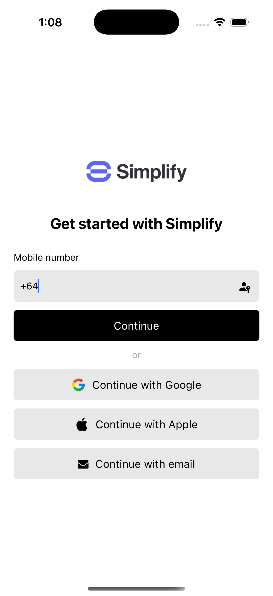

This is an example React Native app which demonstrates [how to integrate Authsignal with Amazon Cognito](https://docs.authsignal.com/integrations/aws-cognito/getting-started).

This app is designed to be used alongside [these Cognito lambdas](https://github.com/authsignal/cognito-lambdas).

The example is inspired by the Uber app. It uses Authsignal SDKs to support the following authentication features.

- Users can sign-in for the first time via SMS OTP or via Google sign-in
- Users are prompted to create a passkey for future sign-ins



The example also demonstrates how to use Authsignal SDKs to implement the following:

- Ensure both email and phone number are verified in the initial registration flow
- Register the device for push auth and respond to authorization requests

## Getting started

Copy `.env.example` and rename to `.env` then fill in the values for your Cognito user pool and Authsignal tenant.

```
AWS_REGION=
USER_POOL_CLIENT_ID=
API_GATEWAY_ID=
AUTHSIGNAL_TENANT=
AUTHSIGNAL_URL=
```

Then install dependencies and run the app.
